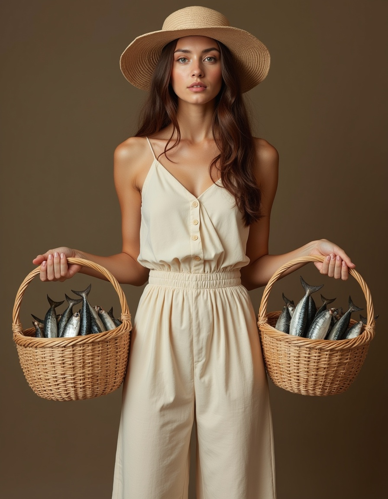
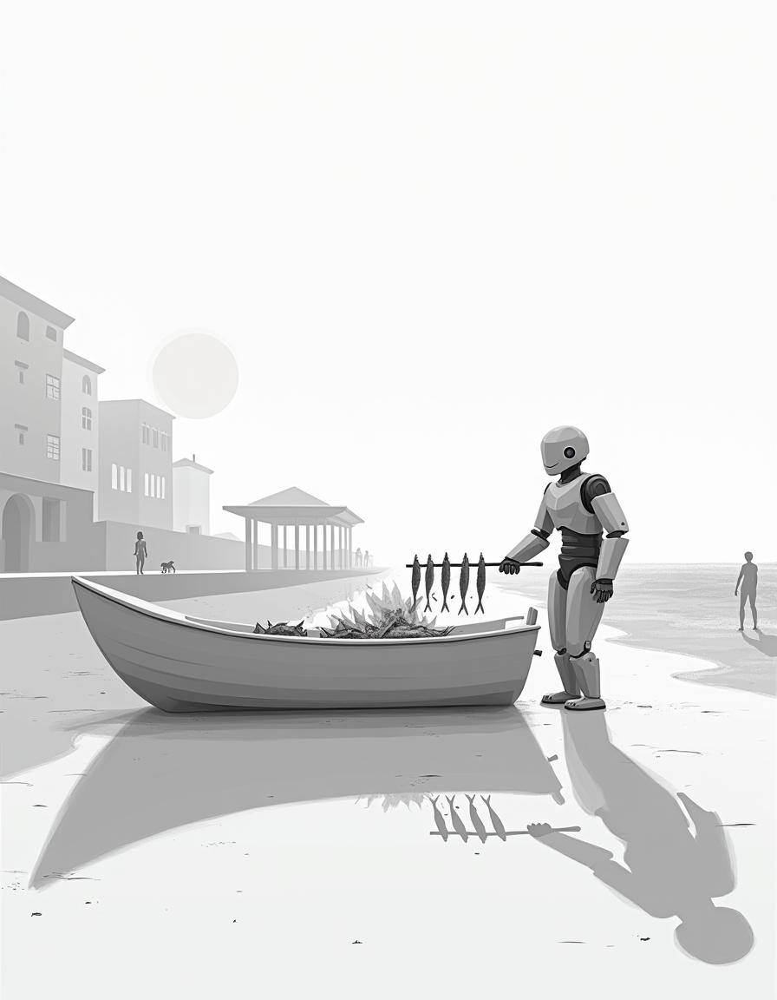
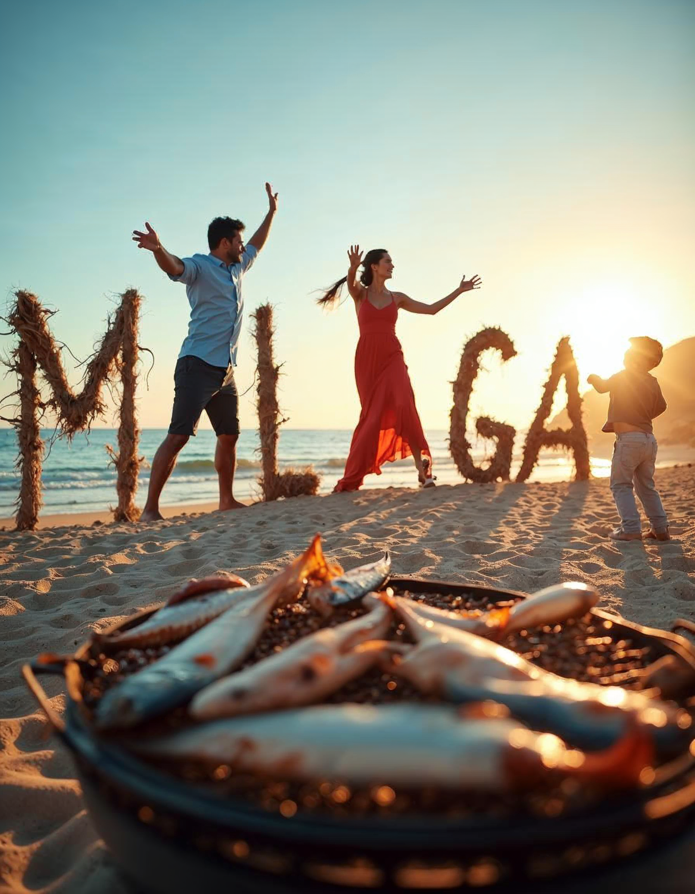

Meet the winning entries for the first text-to-image contest from Malaga-AI with the theme "Malaga in the Age of AI".

The first award goes to [Jaime Vera Durán](https://www.linkedin.com/in/jaimev) for his updated rendition of a timeless symbol of Malaga: [El Cenachero](https://es.wikipedia.org/wiki/Cenachero), a fish seller who carries sardines in straw baskets to sell on the street. Here, a young, elegant woman carries the baskets with a summery vibe in a well-rounded composition. Jaime receives an online course by [Fabiana Aguilar](https://www.linkedin.com/in/fabi-aguilar/) to expand his creative abilities.

    

The second award goes to [Miguel Clavijo](https://www.linkedin.com/in/miguelclavijo19) for his iconic representation of the sand-filled boat roasting sardines for the crowd-pleasing "espeto", sardines on a skewer grilled over wood fire. His image combines the promenade and a temple-like "chiringuito" into a slightly surreal scene, which takes us to a gentle future of seamless blending of the traditional and the modern. Miguel gets an online voucher.

    

The third award goes to [Marta Quirós Dinarès](https://www.linkedin.com/in/martaquiros/) for her joyful depiction of a family dancing on the beach at sunset, while forming the letters of Malaga, with some freshly caught fish in the foreground. The ingenuity of the composition highlights the artistic possibilities of AI technologies. Marta gets another online voucher.

    

Special thanks to our judges [Fabiana Aguilar](https://www.linkedin.com/in/fabi-aguilar/) and [Bence Csernak](https://www.linkedin.com/in/bencecsernak/) for their contribution and to [Freepik](https://www.freepik.com/pikaso/explore?utm_source=malagaaicontest) for offering access to their AI Suite for participants.

Soon we will publish all entries for your viewing pleasure. For now, let's feast on the winners' work.

